<h1>My Web Service Documentation</h1>

This page provides an overview of my web service development process with relevant images.

    <h2>Image 1: Viewing WSDL</h2>
    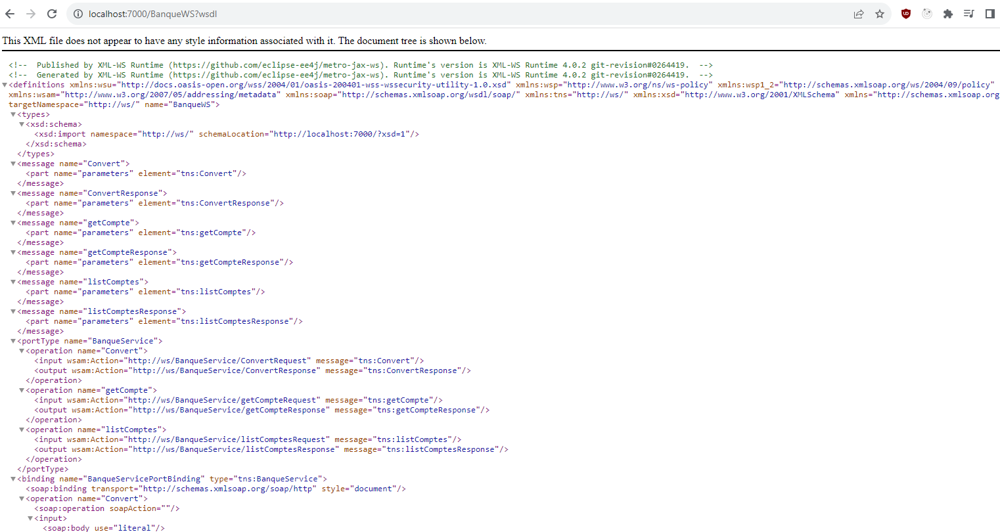
    
Description: This image shows the result when accessing the WSDL of the web service at <a href="http://localhost:7000/?wsdl" target="_blank">http://localhost:7000/?wsdl</a>.

    <h2>Image 2: Accessing XSD</h2>
    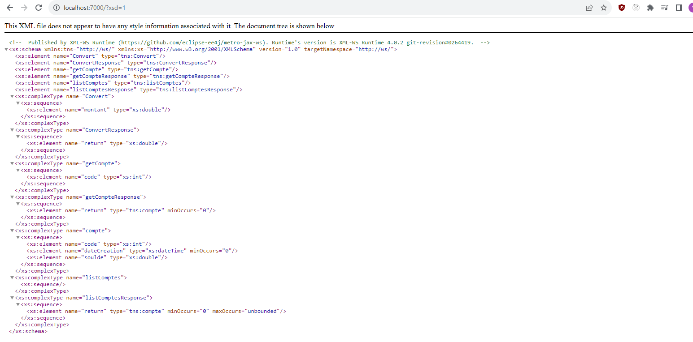
    
Description: This image displays the result of accessing the XSD of the web service at <a href="http://localhost:7000/?xsd=1" target="_blank">http://localhost:7000/?xsd=1</a>.

    <h2>Image 3: SoapUI Initial Page</h2>
    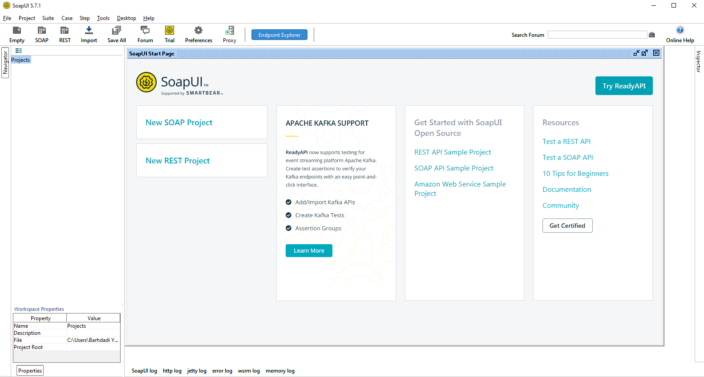
    
Description: This image is the initial page when opening SoapUI.

    <h2>Image 4: Creating a New Soap Project (test1)</h2>
    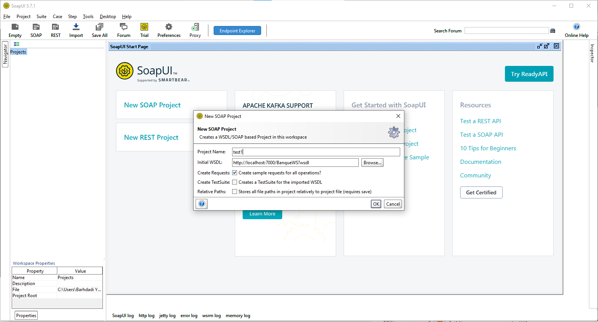
    
Description: This image captures the process of creating a new Soap project named "test1."

    <h2>Image 5: Testing a Request</h2>
    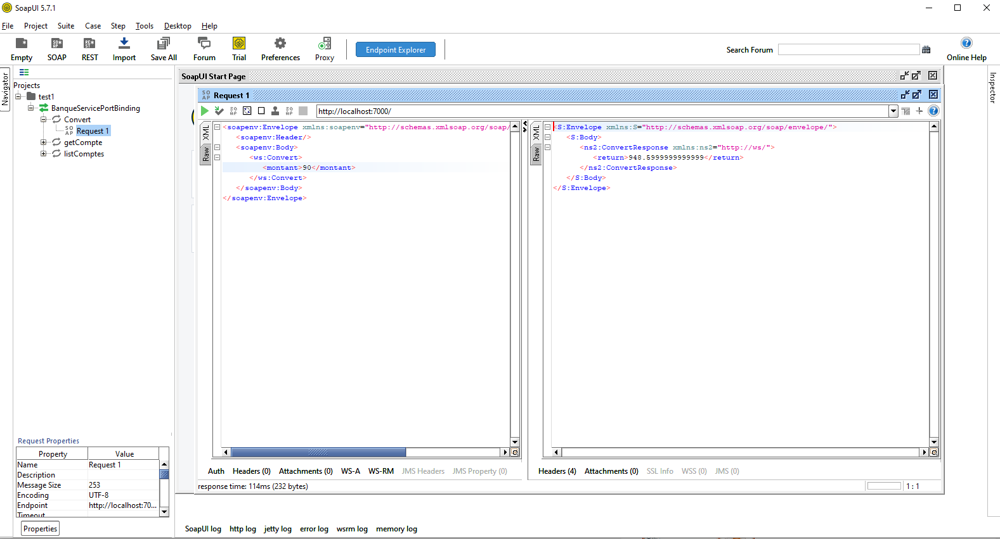
    
Description: This image shows the testing of a specific request within the Soap project.

    <h2>Image 6: Testing a Request</h2>
    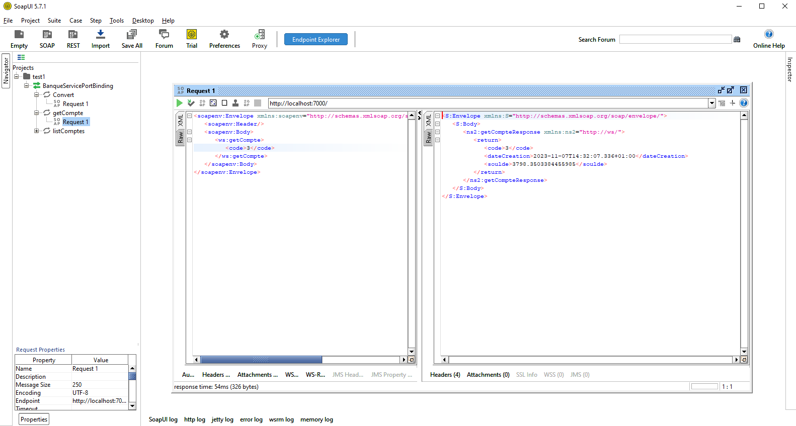
    
Description: This image captures the process of testing another request in the Soap project.

    <h2>Image 7: Testing a Request</h2>
    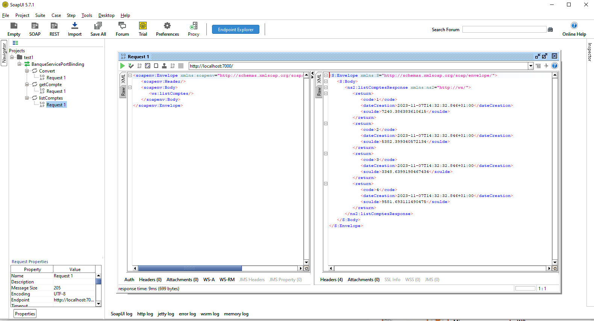
    
Description: This image demonstrates testing a third request in the Soap project.

    <h2>Image 8: Code of Compte Class with Annotations</h2>
    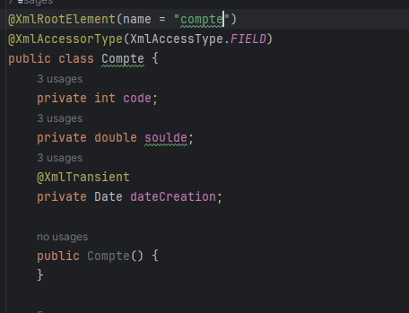
    
Description: In this image, you can see the code for the 'compte' class with annotations, including '@XMLTransient' for 'dateCreation' and '@XMLRooteElement(name="compte")' for the class itself.

    <h2>Image 9: Creating a New Soap Project (test2)</h2>
    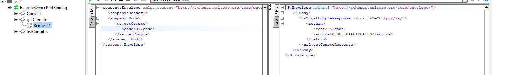
    
Description: This image captures the process of creating a new Soap project named "test2."

    <h2>Image 10: Testing Requests in Project (test2)</h2>
    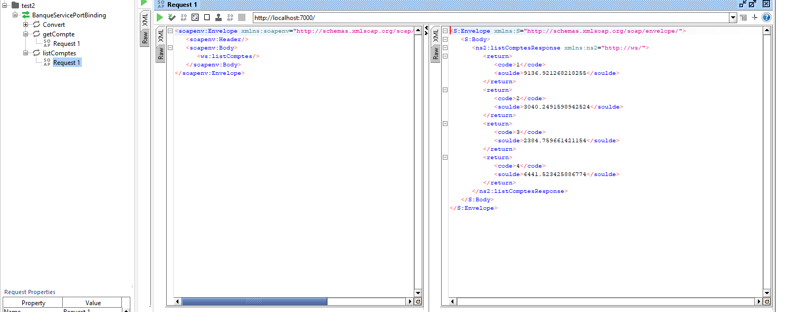
    
Description: This image shows the testing of requests within the "test2" Soap project.

    <h2>Image 11: Generating Proxy for Client</h2>
    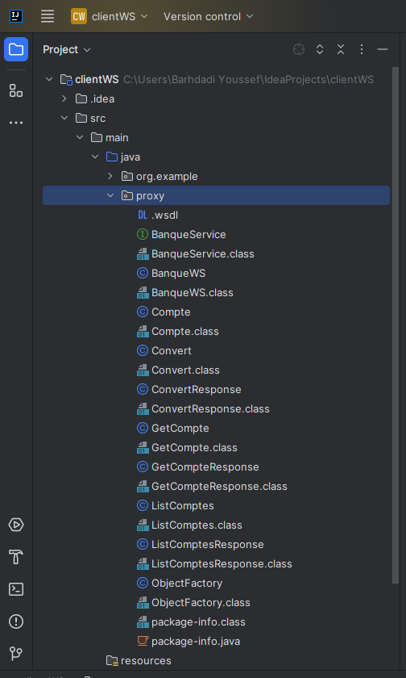
    
Description: This image demonstrates the process of generating a proxy for the client.

    <h2>Image 12: Client Code and Testing</h2>
    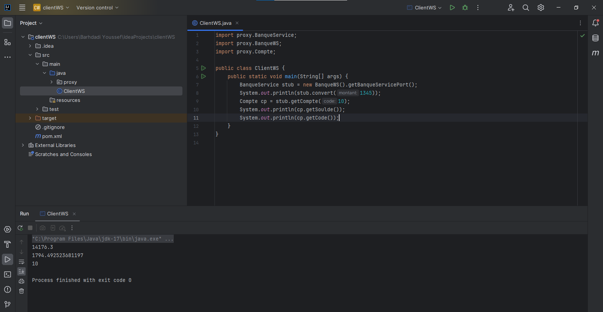
    
Description: This image is about the client code and the testing process.

